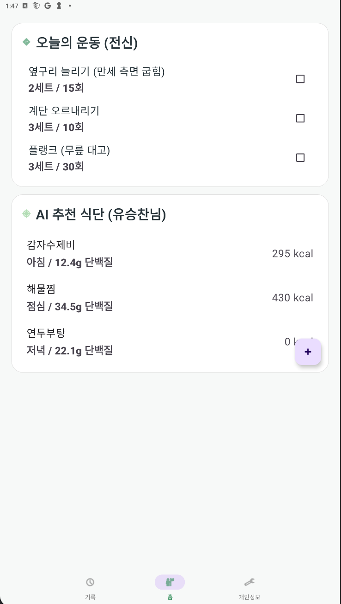
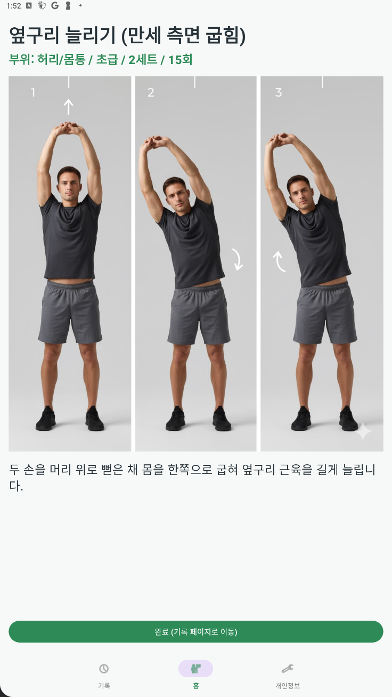
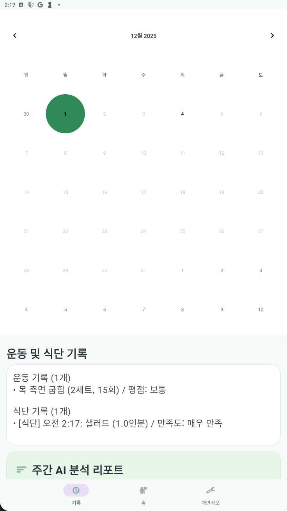
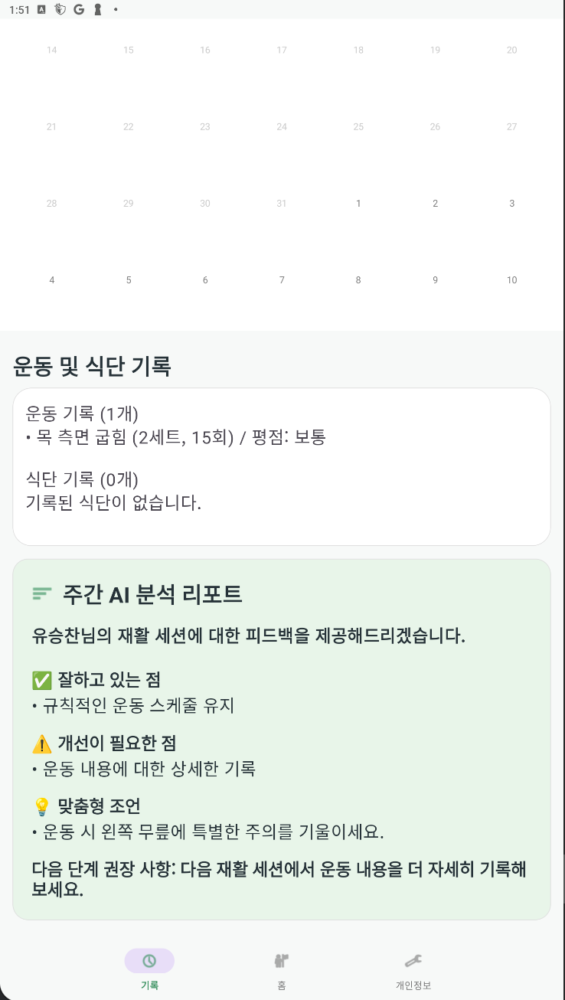

# 🏥 Rehab AI (Data Doctor)


**Rehab AI**는 사용자의 부상 부위, 통증 수준, 신체 정보를 분석하여 **OpenAI GPT 기반의 초개인화된 재활 운동 루틴과 식단을 제공**하는 안드로이드 애플리케이션입니다.  
사용자의 재활 진행 상황을 트래킹하고, AI가 이를 분석하여 주간 리포트와 피드백을 제공함으로써 체계적인 회복을 돕습니다.

---

## ✨ Key Features

* **🤖 AI 맞춤형 데일리 루틴 (Home)**
  * 사용자의 부상 정보(환부, 질환명)와 통증 레벨에 맞춰 매일 새로운 운동 루틴(세트/횟수 포함)을 추천합니다.
  * 영양소 균형을 고려한 AI 추천 식단(칼로리, 단백질 정보 포함)을 제공합니다.

* **📅 스마트 트래킹 & 히스토리 (History)**
  * **캘린더 뷰**: 운동 및 식단 기록 여부를 직관적으로 확인하고 과거 기록을 조회할 수 있습니다.
  * **상세 기록**: 수행한 운동의 평점과 식단 섭취 내역을 상세하게 기록합니다.

* **📊 주간 AI 분석 리포트**
  * 일주일간의 기록을 바탕으로 AI가 **'잘하고 있는 점'**, **'개선이 필요한 점'**, **'맞춤형 조언'**을 분석해줍니다.
  * 다음 단계의 재활 방향성을 제시하여 사용자의 동기 부여를 돕습니다.

* **💪 운동 가이드 & 피드백 (Detail)**
  * 각 운동별 상세 이미지와 설명을 제공하여 정확한 자세로 운동할 수 있도록 돕습니다.
  * 운동 완료 후 수행 만족도와 특이사항을 기록하여 AI 분석 데이터로 활용합니다.

* **👤 개인화 프로필 관리 (Profile)**
  * 부상 부위, 질환명, 현재 통증 수준(Slider UI), 알레르기 정보 등을 상세하게 설정할 수 있습니다.
  * 언제든지 정보를 수정하여 변화하는 상태에 맞춘 추천을 받을 수 있습니다.

---

## 🛠 Tech Stack

### Architecture
* **Clean Architecture**: Presentation, Domain, Data Layer로 엄격하게 분리하여 유지보수성과 테스트 용이성을 확보했습니다.
* **MVVM Pattern**: `ViewModel`과 `StateFlow`를 활용한 단방향 데이터 흐름(UDF)으로 UI 상태를 안전하게 관리합니다.

### Libraries & Tools
* **DI**: [Hilt](https://dagger.dev/hilt/) - 의존성 주입을 통한 모듈 간 결합도 감소.
* **Async**: [Coroutines](https://kotlinlang.org/docs/coroutines-overview.html) & [Flow](https://kotlinlang.org/docs/flow.html) - 비동기 처리 및 리액티브 데이터 스트림.
* **Network**: [Retrofit2](https://square.github.io/retrofit/) & [OkHttp3](https://square.github.io/okhttp/) - OpenAI API 통신.
* **Database**: [Room](https://developer.android.com/training/data-storage/room) - 오프라인 캐싱 및 로컬 데이터 영속성 보장.
* **Auth & Cloud**: [Firebase](https://firebase.google.com/) (Auth, Firestore) - 사용자 인증 및 데이터 동기화.
* **UI**: ViewBinding, Navigation Component (Safe Args), Material Design 3.
* **Calendar**: MaterialCalendarView, ThreeTenABP.

---

## 📂 Project Structure

이 프로젝트는 **Clean Architecture** 원칙을 준수하여 계층별로 모듈화되어 있습니다.

```text
com.dataDoctor.rehabai
├── data                  # Data Layer (데이터 소스 관리 및 저장)
│   ├── local             # Room DB, DAO, Entity (로컬 캐싱)
│   ├── remote            # Retrofit Service, Firebase, DTO (원격 데이터)
│   ├── repository        # Repository 구현체 (SSOT 원칙에 따른 데이터 중개)
│   └── mapper            # Entity/DTO ↔ Domain Model 변환기
│
├── domain                # Domain Layer (순수 비즈니스 로직)
│   ├── model             # 데이터 모델 (User, Exercise, RehabSession 등)
│   ├── repository        # Repository 인터페이스 (추상화)
│   └── usecase           # 비즈니스 로직 단위 (GetAIRecommendation, AnalyzeProgress 등)
│
├── presentation          # UI Layer (사용자 인터랙션 및 화면 표시)
│   ├── auth              # 로그인, 회원가입 화면
│   ├── main              # 홈(대시보드) 화면 (오늘의 루틴)
│   ├── history           # 기록 및 캘린더, AI 분석 화면
│   ├── detail            # 운동/식단 상세 및 피드백 화면
│   ├── profile           # 사용자 정보 및 부상 정보 수정 화면
│   └── viewmodel         # UI State 관리 및 비즈니스 로직 호출
│
└── di                    # Dependency Injection (Hilt Modules)
    ├── NetworkModule     # Retrofit, OkHttp 설정
    ├── DatabaseModule    # Room DB 설정
    └── RepositoryModule  # Repository 바인딩
```

## 🚀 Key Technical Decisions

### 1. Robust Caching Strategy (Single Source of Truth)
네트워크 비용 절감과 사용자 경험 향상을 위해 **Repository Pattern** 내부에서 캐싱 로직을 구현했습니다.
* **Logic**: 데이터를 요청하면 `LocalDataSource(Room)`를 먼저 확인합니다. 데이터가 없거나(Cache Miss) 강제 새로고침이 필요한 경우에만 `RemoteDataSource(OpenAI/Firebase)`를 호출하여 데이터를 가져오고, 이를 다시 로컬 DB에 저장하여 동기화합니다.
* **Benefit**: API 호출 횟수를 최소화하고 앱의 반응 속도를 획기적으로 개선했습니다.

### 2. OpenAI API Integration & Token Optimization
GPT 모델 활용 시 발생할 수 있는 토큰 제한과 비용 문제를 해결하기 위해 요청을 세분화했습니다.
* **Strategy**: 운동 추천(`fetchWorkouts`)과 식단 추천(`fetchDiets`)을 병렬적이거나 독립적으로 요청하도록 설계하여 응답 속도를 높이고 파싱 오류를 줄였습니다.
* **Analysis**: 주간 리포트 생성 시, 단순히 로그를 나열하는 것이 아니라 JSON 포맷팅 프롬프트를 사용하여 앱 내에서 구조화된 데이터(`AIAnalysisResult`)로 파싱할 수 있도록 구현했습니다.

### 3. State Management with StateFlow
* LiveData 대신 `StateFlow`와 `collectLatest`를 사용하여 생명주기를 인식하는 안전한 데이터 수집을 구현했습니다.
* `MainUiState`, `HistoryUiState` 등 UI 상태를 나타내는 Data Class를 정의하여 UI의 일관성을 유지했습니다.

---

## 📥 Setup & Installation

이 프로젝트를 실행하기 위해서는 API Key 설정이 필요합니다.

1.  **Clone the repository**
    ```bash
    git clone [https://github.com/your-username/AndroidProject.git](https://github.com/your-username/AndroidProject.git)
    ```

2.  **Firebase Setup**
    * Firebase 콘솔에서 프로젝트를 생성합니다.
    * `google-services.json` 파일을 다운로드하여 `app/` 디렉토리에 위치시킵니다.
    * Authentication(Email/Google) 및 Firestore Database를 활성화합니다.

3.  **OpenAI API Key Configuration**
    * 프로젝트 루트의 `local.properties` 파일을 엽니다.
    * OpenAI API Key를 다음과 같이 추가합니다.
        ```properties
        sdk.dir=...
        GPT_API_KEY="sk-..."
        ```
    * *Note: `BuildConfig`를 통해 앱 빌드 시 안전하게 주입됩니다.*

4.  **Build & Run**
    * Android Studio에서 프로젝트를 Sync하고 실행합니다. (Minimum SDK: 24)

---

## 📸 Screenshots

| 홈 (대시보드) | 운동 상세 & 피드백 | 캘린더 & 기록 | AI 주간 분석 |
|:---:|:---:|:---:|:---:|
|  |  |  |  |

*(스크린샷 이미지를 `docs/images` 폴더 등에 추가하고 위 경로를 수정해주세요)*

---

## 🤝 Contribution

1.  Fork the Project
2.  Create your Feature Branch (`git checkout -b feature/AmazingFeature`)
3.  Commit your Changes (`git commit -m 'Add some AmazingFeature'`)
4.  Push to the Branch (`git push origin feature/AmazingFeature`)
5.  Open a Pull Request

---

## 📄 License

Distributed under the MIT License. See `LICENSE` for more information.
